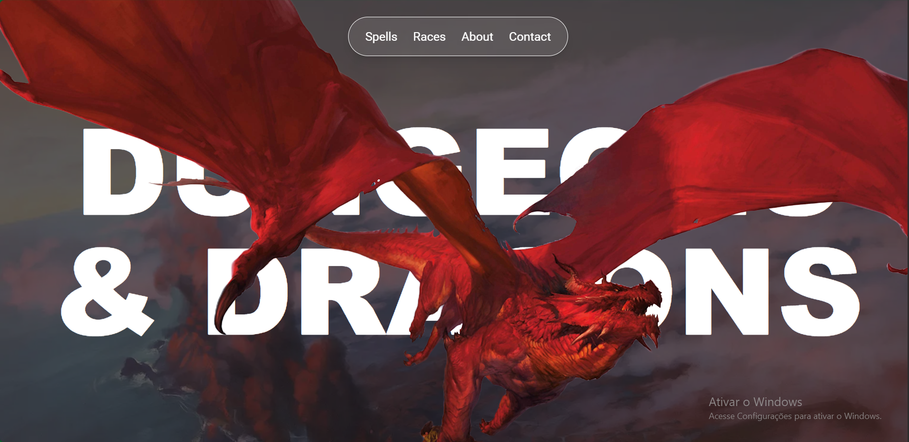

# 🧙‍♂️ Dungeons & Dragons — Web Experience

Uma experiência interativa inspirada no universo de *Dungeons & Dragons*, desenvolvida com **Next.js** e **Tailwind CSS**.
O projeto consome dados da **API oficial de Dungeons & Dragons (D&D 5e API)** para exibir informações sobre raças, magias e muito mais, em um layout imersivo e responsivo.

---

## 🚀 Tecnologias Utilizadas

* **Next.js 15**
* **React 19**
* **Tailwind CSS**
* **GSAP (GreenSock Animation Platform)**
* **TypeScript**
* **D&D 5e API** ([https://www.dnd5eapi.co/](https://www.dnd5eapi.co/))

---

## 🗂️ Estrutura do Projeto

```
dungeons-and-dragons-main/
├── public/             # Imagens e assets estáticos
├── components/         # Componentes reutilizáveis (Header, Footer, Navbar, etc.)
├── sections/           # Seções principais (About, Races, Spells, etc.)
├── app/                # Rotas e páginas do Next.js
└── package.json        # Dependências e scripts
```

---

## 🧩 Funcionalidades Principais

* Exibição dinâmica de **raças** e **magias** via integração com a D&D API
* Animações fluidas com **GSAP** e **ScrollTrigger**
* Design **responsivo**, adaptado para desktop, tablet e mobile
* Código modular e organizado em componentes reutilizáveis

---

## 🖼️ Demonstração do Projeto

### 🌄 Página Inicial



---

## ⚙️ Como Executar Localmente

1. **Clone o repositório:**

   ```bash
   git clone https:/github.com/VictorASDev/dungeons-and-dragons.git
   ```

2. **Acesse o diretório do projeto:**

   ```bash
   cd dungeons-and-dragons
   ```

3. **Instale as dependências:**

   ```bash
   npm install
   ```

4. **Execute o servidor de desenvolvimento:**

   ```bash
   npm run dev
   ```

5. **Abra o projeto no navegador:**

   ```
   http://localhost:3000
   ```

---

## 💡 Possíveis Melhorias Futuras

* Adicionar uma seção de **monstros** e **classes**
* Adicionar **traduções automáticas** para PT-BR

---

## 🤝 Contribuições

Contribuições são bem-vindas!
Se quiser sugerir melhorias, abrir *issues* ou enviar *pull requests*, fique à vontade.

---

## 👨‍💻 Autor

**Victor Augusto**
Estudante de Sistemas de Informação (IFBA)
---

## 📜 Licença

Este projeto é distribuído sob a licença **MIT**.

---
